# RAMSES Parameter Management

This document outlines the architecture and flow of parameter management in the RAMSES integration, focusing on FAN device parameters.

## Architecture Components

### 1. **HVAC Platform** (`hvac.py`) (ramses_rf)
- **Role**: 2411 Message Processing and Parameter Management
- **Function**: Manages device discovery and parameter updates
  - `handle_2411_message`: Handles 2411 messages from FAN devices
  - `add_bound_device`: Adds a bound device to this FAN (from config_flow)
  - `get_bound_rem`: Gets the first bound REM/DIS device ID for this FAN
  - `get_fan_param`: Gets a fan parameter value from the device's message store (e.g., `2411_4E`)
  - `set_fan_param`: Sets a fan parameter value with request/response tracking
  - `supports_2411`: Checks if the device supports 2411 messages
  - `hgi`: Returns the HGI device if available
- **Key Callbacks**:
  - `set_initialized_callback()`: Called once when device is ready
  - `_handle_initialized_callback()`: Internal handler for initialization
  - `set_param_update_callback()`: Set callback for parameter updates
  - `_handle_param_update()`: Internal handler for parameter changes

### 2. **Broker**
- **Role**: Service call processing and command execution
- **Function**: Manages parameter operations and device communication
- **Key Methods**:
  - `_async_create_parameter_entities`: Creates Home Assistant number entities for all 2411 parameters
  - `async_get_fan_param`: Sends a parameter read request to a FAN device
  - `async_set_fan_param`: Sends a parameter write request to a FAN device
  - `async_get_all_fan_params`: Requests all parameters from a FAN device
- **Helper Methods**:
  - `_find_param_entity`: Locates parameter entities by device and parameter ID
  - `_get_param_id`: Validates and normalizes parameter IDs
  - `_get_device_and_from_id`: Resolves source device with fallback logic
  - `_setup_fan_bound_devices`: Configures bound REM/DIS devices for FAN parameter access
- **Callback Methods**:
  - `on_fan_first_message`: Handler for first message from FAN device
  - `async_add_ramses_update_callback`: Register for device updates
  - `async_remove_ramses_update_callback`: Remove update subscription
  - `_handle_ramses_update`: Internal handler for device updates
  - `_handle_param_update`: Internal handler for parameter changes
- **Key Capabilities**:
  - Creates and manages parameter entities in the number platform
  - Handles parameter read/write operations with proper validation
  - Manages device bindings for parameter access
  - Processes parameter updates and synchronizes with Home Assistant
  - Supports both direct parameter access and batch operations
  - Handles parameter value validation and normalization
- **Integration Points**:
  - Interfaces with HVAC devices for parameter operations
  - Manages parameter entities in Home Assistant
  - Handles service calls for parameter operations
  - Coordinates with the event system for state updates (`SIGNAL_UPDATE`)
  - Maintains pending state for parameter operations
  - Provides error handling and logging for parameter operations
- **Error Handling**:
  - Validates all parameter IDs and values
  - Handles device communication errors gracefully
  - Provides detailed logging for debugging
  - Maintains pending state for async operations

### 3. **Schemas** (`schemas.py`) (ramses_cc)
- **Role**: Input validation and service definitions
- **Function**: Defines service schemas and validates input parameters
- `SCH_GET_FAN_PARAM`, `SCH_SET_FAN_PARAM`, `SCH_UPDATE_FAN_PARAMS`
- `FAN_TRAITS` adds `bound` to the schema

### 4. **Number Platform** (number.py)
- **Role**: Manages parameter entities in Home Assistant
- **Key Components**:
  - `RamsesNumberParam`: Entity class for parameter values
  - `RamsesNumberEntityDescription`: Describes parameter metadata
  - `async_create_parameter_entities`: Factory function for parameter entities

#### RamsesNumberBase Class
- **Purpose**: Base class for number entities
- **Key Components**:
  - `set_pending`: Sets the entity to a pending state with an optional value
  - `clear_pending`: Clears the pending state and any pending value
  - `_clear_pending_after_timeout`: Clears the pending state after a timeout
  - `__init__`: Initializes the entity with a broker, device, and entity description
  - `_scale_for_storage`: Scales a value for storage based on the entity's configuration
  - `_scale_for_display`: Converts and scales a stored value for display based on the entity's configuration
  - `_validate_value_range`: Validates that a value is within the allowed range for this entity
  - `_validate_and_scale_value`: Validates and scales a value for the entity in a single operation

#### RamsesNumberParam Class
- **Purpose**: Represents a single parameter as a Home Assistant number entity
- **Key Features**:
  - Handles parameter value scaling and validation
  - Manages pending states for async operations
  - Supports percentage and direct value modes
  - Implements parameter update callbacks
- **Key Components**:
  - `async_added_to_hass`: Runs when entity is about to be added to Home Assistant
  - `async_set_native_value`: Sets a new parameter value
  - `_request_parameter_value`: Requests current value from device
  - `_async_param_updated`: Handles parameter update events
  - `icon`: Returns the icon to use in the frontend
  - `native_value`: Current parameter value (scaled for display)
  - `available`: Returns True if the entity is available, False otherwise

#### RamsesNumberEntityDescription Class
- **Purpose**: Describes parameter metadata
- **Key Components**:
  - `ramses_rf_attr`: The parameter ID from the device
  - `native_min_value`: Minimum allowed value
  - `native_max_value`: Maximum allowed value
  - `native_step`: Step size for UI controls
  - `native_unit_of_measurement`: Unit of measurement
  - `percentage`: Whether the parameter should be displayed as a percentage

#### Parameter Entity Creation
- **Process**:
  1. `async_setup_entry` registers the platform
  2. `async_create_parameter_entities` creates entities for each supported parameter
  3. `get_param_descriptions` returns a list of entity descriptions for all parameters supported by the device
  4. Entities are added to Home Assistant with `async_add_entities`
  5. Initial parameter values are requested with `_request_parameter_value`

### 5. **Callback System**
- **Role**: Asynchronous event handling and state updates
- **Function**: Manages subscription to device updates and parameter changes
- **Purpose**: Handles parameter updates and device state changes. We are not using the polling system of Home Assistant.
    We use fire-and-forget messages to the device and update whenever the device responds (to anyone).
    And when we set a new value, we don't want to wait for up to a minute to get a confirmation of the new value.
- **Key Components**:
  - `async_add_ramses_update_callback()` - Register for device updates
  - `async_remove_ramses_update_callback()` - Remove update subscription
  - `_handle_device_update()` - Processes incoming device updates
  - `_handle_param_update()` - Handles parameter-specific updates
- **Event Types**:
  - Device discovery
  - Parameter value changes
  - Connection state changes

## Callback Flow

```mermaid
graph TD
    %% Main layout direction
    direction TB

    %% Left side: Initialization Flow
        subgraph "Initialization & Setup Flow"
            direction TB
            A[Device receives 1st message] --> B(Device calls _initialized_callback)
            B --> C[Broker: on_fan_first_message]
            C --> C1[_async_create_parameter_entities]
            C --> C2[async_get_all_fan_params]
            C1 --> D[get_param_descriptions]
            D --> E[Creates RamsesNumberParam entities]
            E -->|async_add_entities| F(HA Core)
            F -->|Calls| G[RamsesNumberParam.async_added_to_hass]
            G --> H[Register event listener for fan_param_updated]
            G --> I[_request_parameter_value]
            I --> J[Reads value from Device State from cache]
            J --> K[Updates entity state]
            K --> L[self.async_write_ha_state]
        end

    %% Right side: Live Update Flow
    subgraph "Live Update Flow"
        direction TB
        L(Device) -->|Receives RP 2411 Msg| M[Device._handle_msg]
        M --> O[_param_update_callback]
        O --> P[Broker fires ramses_cc.fan_param_updated]
        P --> Q{HA Event Bus}
        Q -->|ramses_cc.fan_param_updated| R[RamsesNumberParam._async_param_updated]
        Q --> R[Updates entity state]
        R --> S[self.async_write_ha_state]
    end

    %% Race Condition at the bottom
    subgraph "Race Condition: Update Arrives Too Early"
        direction LR
        RC1(Device) -- RP 2411 Msg --> RC2[Device._handle_msg]
        RC2 --> RC3[_param_update_callback]
        RC3 --> RC4[Broker fires ramses_cc.fan_param_updated]
        RC4 --> RC5{HA Event Bus}
        RC5 -- ramses_cc.fan_param_updated --> RC6((X))
        RC6 --> RC7[Event is missed]
        RC7 -.->|"Entity has no listener yet"| H
    end

    %% Styling
    classDef broker fill:#900,stroke:#fff,stroke-width:2px;
    classDef number_platform fill:#090,stroke:#fff,stroke-width:2px;
    classDef entity fill:#009,stroke:#fff,stroke-width:2px;
    classDef device fill:#222,stroke:#fff,stroke-width:2px;
    classDef event_bus fill:#660066,stroke:#fff,stroke-width:2px;

    %% Apply styles
    class C,C1,C2,O,P,RC3,RC4 broker;
    class D,E,RC7 number_platform;
    class G,H,I,J,R,S entity;
    class A,B,K,L,M,N,RC1,RC2 device;
    class Q,RC5 event_bus;
```



**Key Points:**
- Uses `set_initialized_callback()` for one-time setup when device is ready
- Processes 2411 messages to detect parameter support
- Stores parameters with `2411_XX` format (e.g., `2411_4E`)
- Calls registered callbacks for initialization and parameter updates
- Maintains internal state of supported parameters and bound devices

## Race Conditions and Timing Considerations

### Parameter Message Handling Challenges
1. **Early Parameter Messages**
   - Parameter messages may appear in the message cache before device initialization is complete
   - This can lead to premature triggering of 2411 support detection
   - **Solution**: Use `set_initialized_callback()` to ensure proper initialization order

2. **Entity Registration Timing**
   - Entities must be fully registered before processing parameter updates
   - Early parameter updates may be lost if entities aren't ready
   - **Solution**: Implement pending state tracking for early updates

3. **Device Initialization**
   - Devices must be fully initialized before processing parameter operations
   - Parameter requests before initialization complete may fail silently
   - **Solution**: Queue parameter operations until device reports ready state

4. **Polling**
Polling is disabled for parameter entities. But HA will call `native_value` a few times
   after `async_added_to_hass` to get the initial value.

## Bound Device Integration

### Configuration
To set a parameter value on a FAN, a bound REM/DIS device is needed to get a response.
Bound devices are configured via the integration's known devices:
When found, the bound device id is stored in the device entity. (hvac)
```
"32:153289":
  class: FAN
  bound: "37:168270"
"37:168270":
  class: REM
  faked: true
```

### get/set fan commands src_id:
1. from_id (optional)
2. bound (if set)
3. HGI

## Service Interfaces

### Get Fan Parameter
```yaml
service: ramses_cc.get_fan_param
data:
  device_id: "32:153289"  # Required: Target FAN device
  param_id: "4E"          # Required: Parameter to read
  from_id: "18:123456"    # Optional: Source device (bound/HGI)
```

### Set Fan Parameter
```yaml
service: ramses_cc.set_fan_param
data:
  device_id: "32:153289"  # Required: Target FAN device
  param_id: "4E"          # Required: Parameter to set
  value: "25"             # Required: Value to set
  from_id: "18:123456"    # Optional: Source device (bound/HGI)
```

### Update All Parameters
```yaml
service: ramses_cc.update_fan_params
data:
  device_id: "32:153289"  # Required: Target FAN device
  from_id: "18:123456"    # Optional: Source device (bound/HGI)
```
