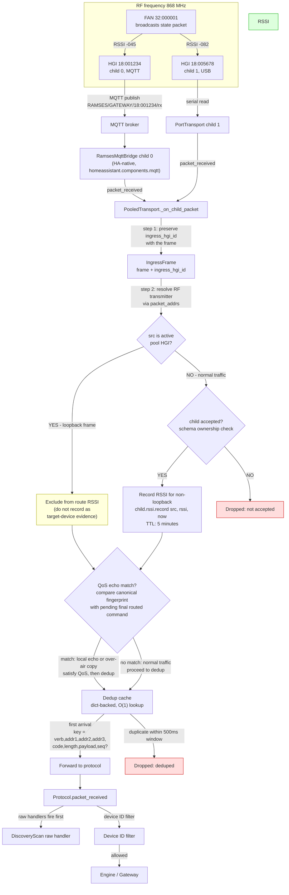

# Inbound: device sends a packet, two HGIs hear it

## Key points (new plan)

- Both HGIs hear the same RF packet with different RSSI due to distance
- **Inbound processing order** (plan section "Ingress provenance and cross-dongle loopback"):
  1. Preserve `ingress_hgi_id` with the frame
  2. Resolve RF transmitter; if src is an active pool HGI, exclude from route RSSI (not `addr1` heuristic)
  3. Compare canonical echo fingerprint with pending final routed command
  4. Normalize transport-assigned sequence for echo matching
  5. Treat exact match from selected child as local echo; from other children as over-air copy
  6. Satisfy QoS, then deduplicate remaining copies
  7. Do not blanket-suppress unrelated frames whose `addr1` is an active HGI
- **RSSI recorded before dedup but after loopback exclusion** — loopback frames never enter route RSSI
- **Schema ownership** is canonical for acceptance (not a separate `accepted_hgis` set)
- **Dedup is dict-backed** (O(1) lookup), key includes sequence when present (resolved from fixtures: sequence is stable across HGIs, 50/50)
- **RSSI TTL: 5 minutes** — stale samples expire automatically (resolved from fixtures)
- **500 ms dedup window** confirmed from fixtures (median delta 5.9 ms, max 499.6 ms, 0/149 outside window)
- Inbound frames retain receiving-HGI provenance independently from `addr1` (invariant 8)
