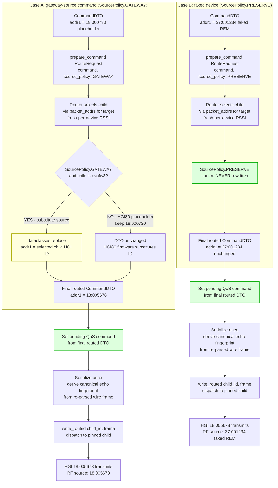

# Outbound: send a command via typed pre-serialization routing

The new plan moves route selection to a typed pre-serialization boundary.
The pool no longer parses ASCII frames with `.split()` to extract addresses.

## Key points (new plan)

- **Typed pre-serialization routing**: route selection happens on `CommandDTO`, not on a serialized ASCII frame string
- **SourcePolicy.GATEWAY vs PRESERVE**: explicit intent, not an `addr1.startswith("18:")` heuristic
- **`dataclasses.replace()`** for source substitution — no string manipulation
- **QoS echo fingerprint** derived from the final routed wire command (invariant 9, 15)
- **Serialize once** per attempt; QoS retry is a new routed attempt that may select a different child
- **No double-patching**: `_patch_cmd_if_needed` is folded into the preparation step
- HGI80 exception: placeholder `18:000730` kept for HGI80 children (firmware substitutes its own ID)
- Faked-device sources (`37:001234`) are preserved — no `18:` prefix heuristic
