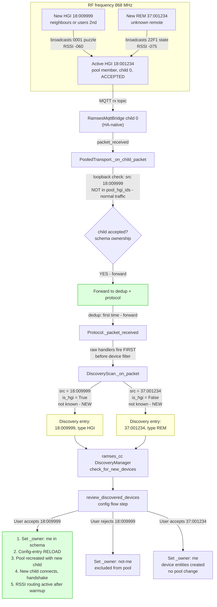

# Discovery: new HGI or REM detected

## Key points (new plan)

- **Schema ownership is canonical** for acceptance — no separate `accepted_hgis` authority
- Packets from a new HGI are forwarded if heard by an accepted pool member
- Scan engine sees them via raw handler and creates discovery entries
- **Config-entry reload** is the membership-change mechanism (invariant 19) — no runtime `add_child()`
- Newly wildcard-discovered MQTT IDs remain non-routable discovery records until acceptance and reload (invariant 21)
- Cold-start after reload: new child uses deterministic primary fallback until RSSI samples accumulate
