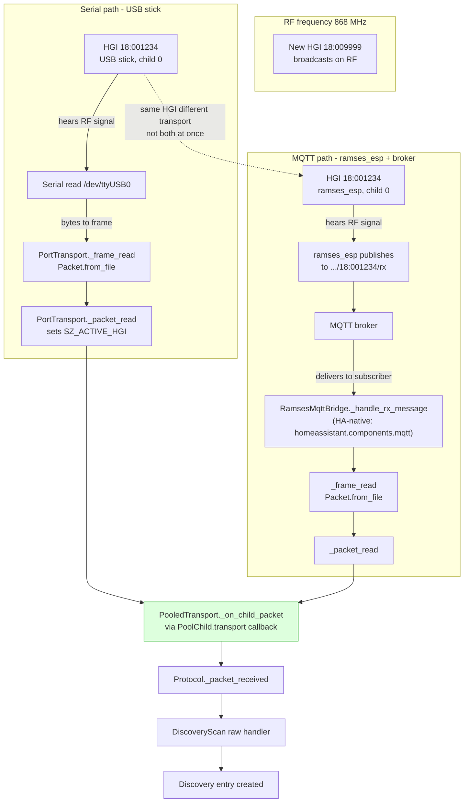

# Transport transparency: serial vs MQTT vs Zigbee

## Transport comparison

| Transport | RF receiver | Delivery to pool | Send-ready |
|---|---|---|---|
| Serial USB | USB stick | Serial bytes to frame to Packet | Phase 2 (after hardware feasibility gate) |
| MQTT ramses_esp | ramses_esp radio | MQTT publish to broker to RamsesMqttBridge to Packet | Phase 1 (after ESP online/LWT) |
| Zigbee | Zigbee coordinator radio | Zigbee cluster attr to Packet | Phase 3 (after IEEE identity separated) |

All three converge at the `PoolChild.transport` callback to `pool._on_child_packet`
to `Protocol._packet_received` to raw handlers to `DiscoveryScan._on_packet`.
The pool treats all children the same via the transport-neutral child interface.

## Key points (new plan)

- Each child is a `PoolChild` object with distinct `connection_state`, `node_availability`, `send_ready`, and `rssi` (invariant 20)
- **Phase 1 (MQTT-only):** only MQTT children are instantiated; serial and Zigbee are gated in the config flow with "(not yet supported)" markers
- **Phase 2 (serial/hybrid):** serial children are un-gated; `send_ready=False` until the hardware feasibility gate is passed
- **Phase 3 (Zigbee):** Zigbee children are un-gated after IEEE/RAMSES identity separation
- MQTT LWT/offline propagates into `node_availability`, not just `connection_state`
- Inside HA, MQTT uses `RamsesMqttBridge` (`homeassistant.components.mqtt`), not `MqttTransport` (direct paho)
- Zigbee is not advertised as supported until IEEE transport identity and RAMSES HGI identity are separated (invariant 13)
