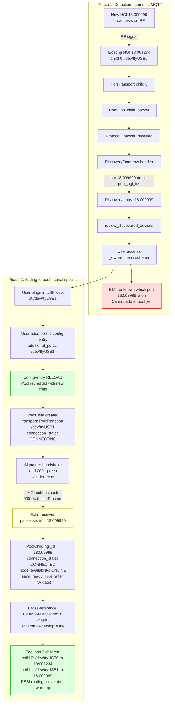

# Adding a new serial USB gateway to the pool

Serial has a bootstrapping problem: the scan engine knows a new HGI ID
exists from RF, but not which physical port it is on.

## MQTT vs Serial comparison

| Aspect | MQTT | Serial |
|---|---|---|
| HGI ID known before adding? | Yes from scan engine | No, only after handshake |
| URL format | mqtt://broker/.../18:009999 | /dev/ttyUSB1 |
| How HGI ID discovered | ramses_esp topic path | 0001 puzzle echo src.id |
| Can accept directly? | Yes, construct URL | No, need physical port first |
| Membership change mechanism | Config-entry reload | Config-entry reload |

## Key points (new plan)

- **Phase 2 feature:** serial USB gateways are gated in the config flow during Phase 1 (MQTT-only). This diagram shows the Phase 2 target after serial is un-gated.
- **Config-entry reload** is the only membership-change mechanism (invariant 19) — no runtime `add_child()`
- Serial children are created with `send_ready=False` until the hardware feasibility gate is passed
- The ESP USB reset behavior must be characterized before the serial PR starts (hardware feasibility gate, Phase 2 prerequisite)
- After reload, the new child follows the same cold-start path: deterministic primary fallback → RSSI-based selection as samples accumulate
- **HA USB consumer listing (issue 1143):** the port picker relies on HA detecting ramses_cc as a USB consumer. HA 2026.9+ checks flat key paths only; if the nested `("serial_port", "port_name")` path is not supported by HA core, PR 5 must flatten the key or add a compatibility shim
