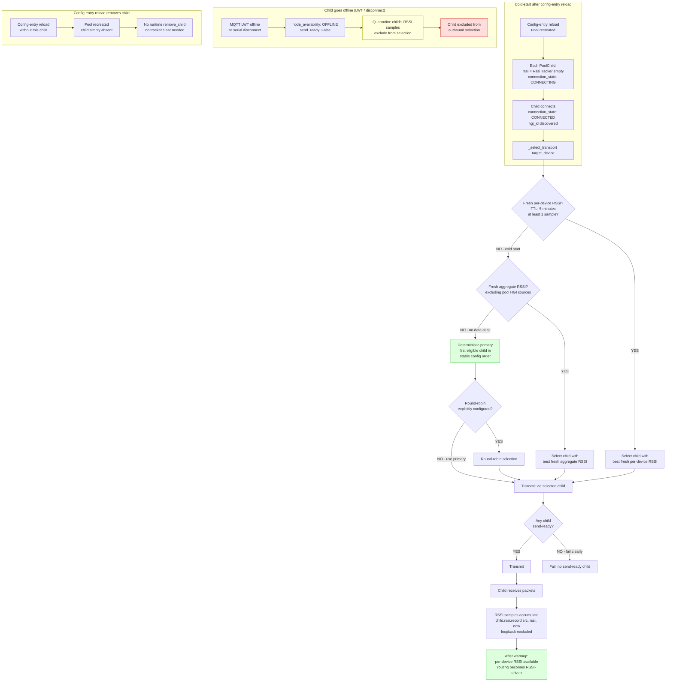

# RSSI routing: cold-start, warmup, and child lifecycle

## Key points (new plan)

- **Cold-start routing is deterministic**: first eligible child in stable config order (invariant 16) — never round-robin unless explicitly configured
- **RSSI TTL: 5 minutes** — stale samples expire automatically (resolved from fixtures)
- **Loopback excluded** from route RSSI, including aggregate fallback (invariant 15)
- **Fallback chain** (plan section "RSSI routing"): fresh per-device RSSI → fresh aggregate RSSI (excluding pool HGIs) → first eligible child in stable config order → round-robin only if explicitly configured → fail clearly if no child is send-ready
- **Never multicast**: exactly one HGI transmits per attempt (invariant 16)
- **No runtime add/remove**: config-entry reload is the only membership-change mechanism (invariant 19)
- **Node availability** is distinct from connection state: LWT offline sets `node_availability=OFFLINE` and quarantines RSSI without dropping the connection
- **Health timeout ≥ 120s**: packet silence expires route evidence but does not itself mark a connected serial radio offline (observed: 60s was too aggressive)
